# 📂 To-Do App – Django Application

This is a standalone Django application within a larger internship project that enables users to manage their personal daily to-do tasks. Authenticated users can create categorized daily lists, add tasks with subtasks, and track their completion progress. Superusers (admins) have access to all content, including private tasks.

---

## 🔧 Features


- 📅 Daily Task Lists: Create separate to-do lists for each day


- 📌 Task Management: Add, update, and delete tasks within a daily list


- 🧩 Subtasks: Break tasks into subtasks and track them individually


- 📊 Progress Tracking: Visual progress bars reflect subtask completion status


- 📂 Hierarchical Categories: Group daily lists under nested categories


- 🔐 Private Tasks: Mark tasks as private (visible only to the owner)


- 🛡️ Admin Access: Superusers can view all tasks regardless of privacy setting


- 🔁 Interactive UI:
 

Toggle task/subtask status with AJAX

Dynamic collapsible “Add” buttons for tasks and subtasks

Real-time updates without page reload


- ⏰ Deadline Support: Optional fields for due dates and completion dates


- 🎨 Clean & Responsive UI: Built with Bootstrap and custom styles

---

### 🔍 Interface Overview

### 🔑 Login Page
Enables users to log in with their credentials.

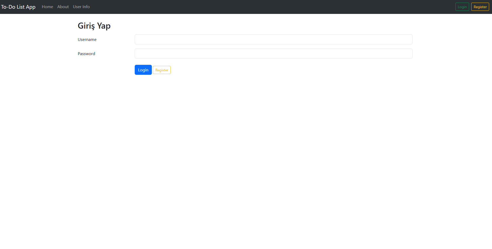

### ✍️ Register Page
Lets users register a new account by entering a username and password.

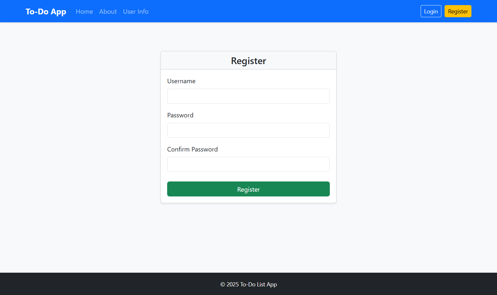

### 🧱 Home Page
Provides the common layout structure shared across all pages.

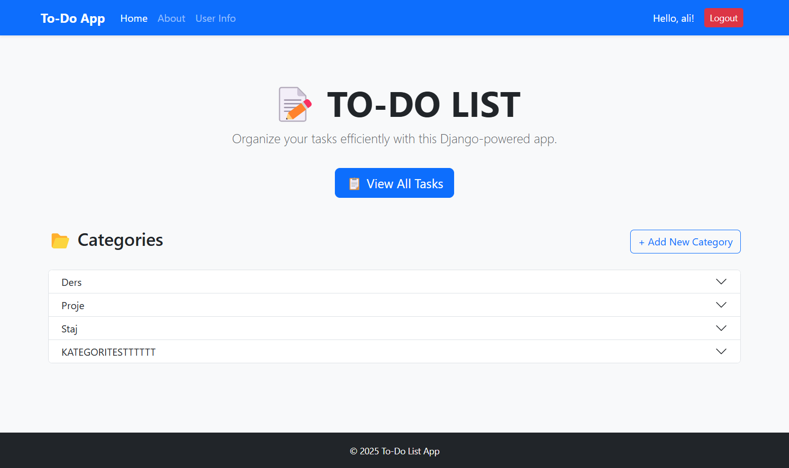

### 📄 All To-Dos
Lists to-dos for the logged-in user. Admins can see all tasks.

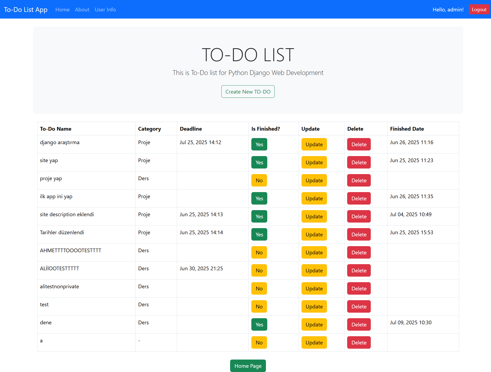

### ➕ Create To-Do
Allows creation of a new to-do, category selection, and optional privacy marking.

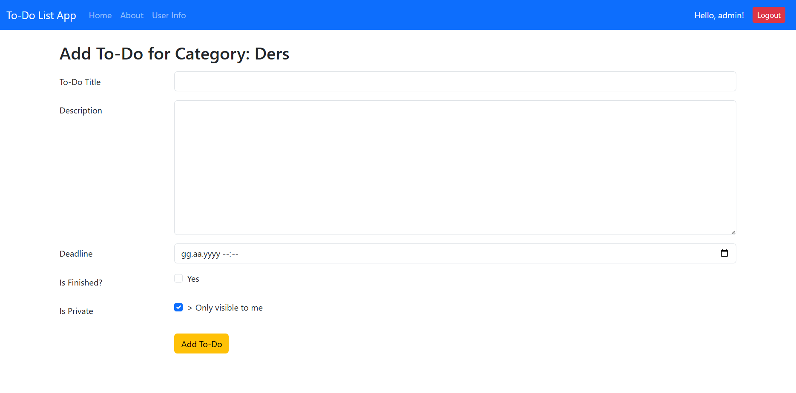

### ✏️ Update To-Do
Update a task's title, description, deadline, or finished state.

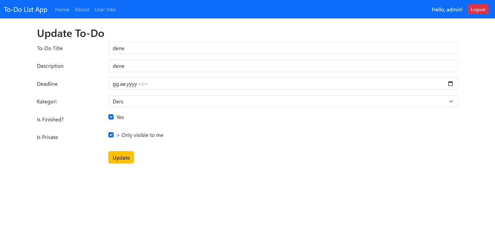

### 📂 Category View
Show tasks under a specific category.

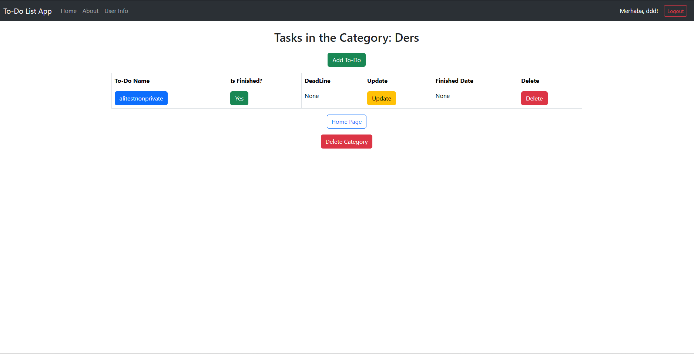

### ➕ Add Category
Users can define new categories.

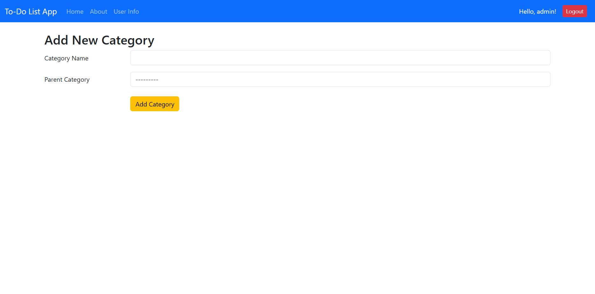

### 👤 User Info Page
Displays current user details.

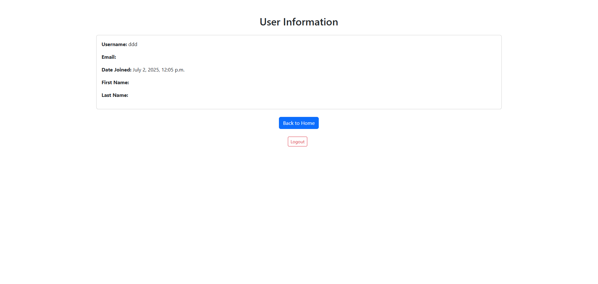

### ℹ️ About Page
Static information page about the app.

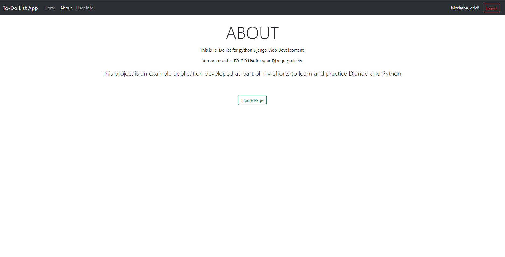

### 📝 To-Do Description Page
Displays the detailed description of a selected to-do item.

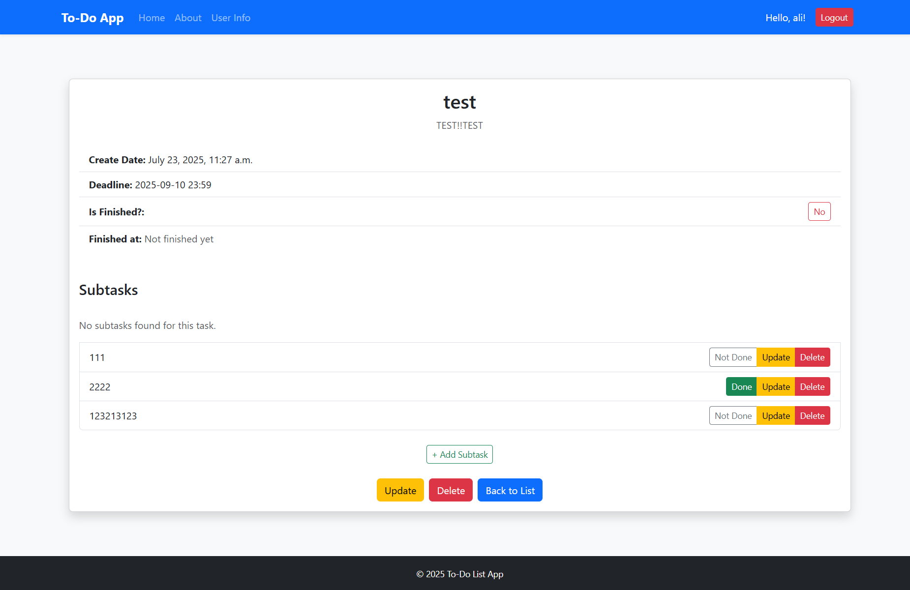

### 🗓️ Daily List Detail
Shows the details of a specific daily to-do list, including all tasks and their statuses.

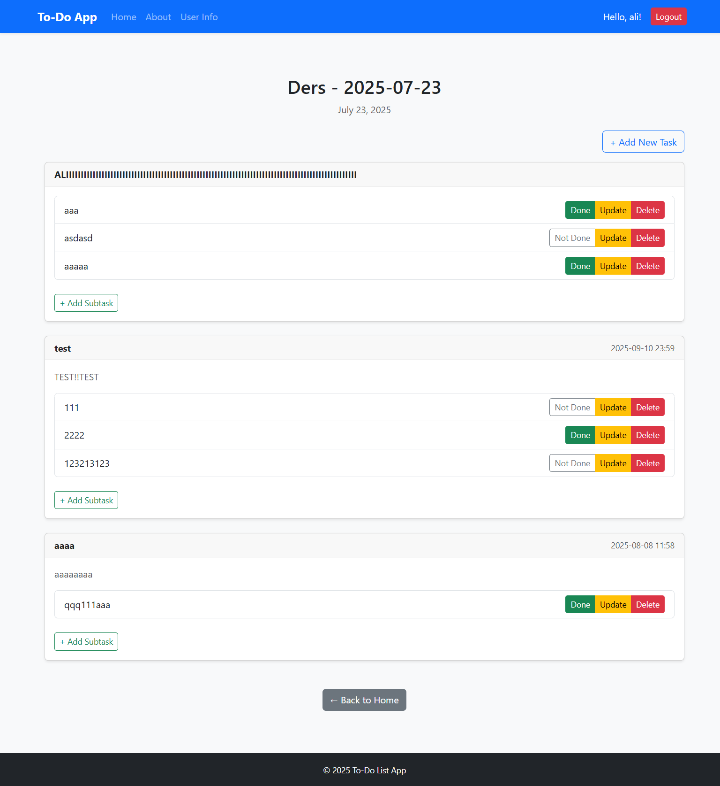

### 🔄 Update Category
Modify the name or details of an existing category.

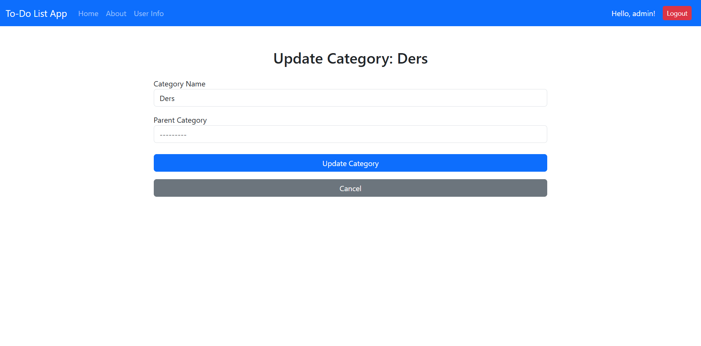


---

## 🚀 Usage

This app is part of a Django project. Make sure to run migrations and create a superuser before use:

```bash
python manage.py makemigrations
python manage.py migrate
python manage.py createsuperuser
python manage.py runserver
```

---

## 🌐 Notes

- By default, new to-dos are marked as private.
- Admin users can view and manage all to-dos, including private ones.
- The interface uses Bootstrap 5 for styling.

---

Feel free to customize the app and extend its functionality as needed!

