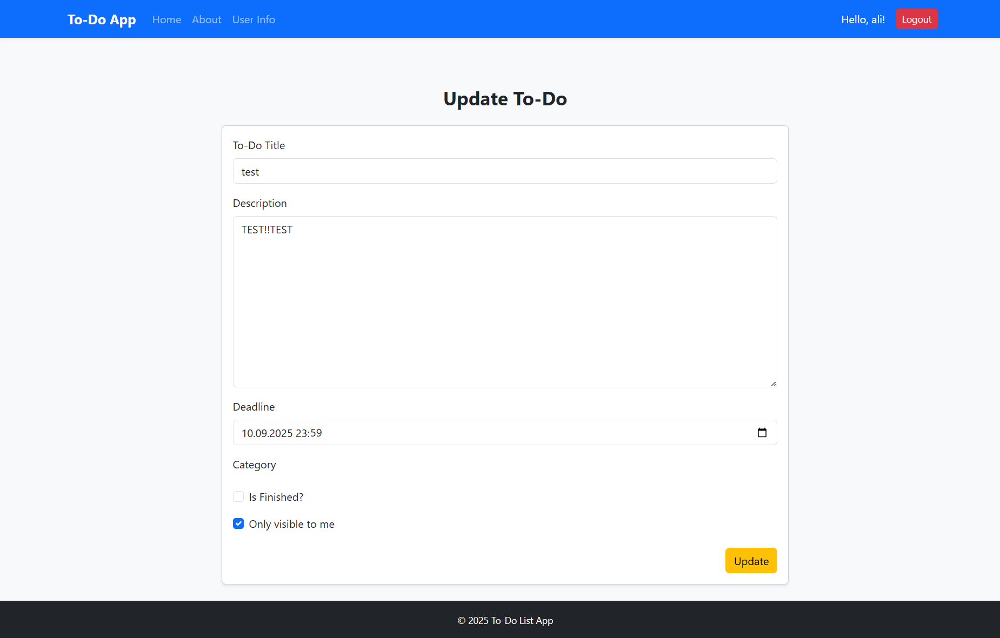
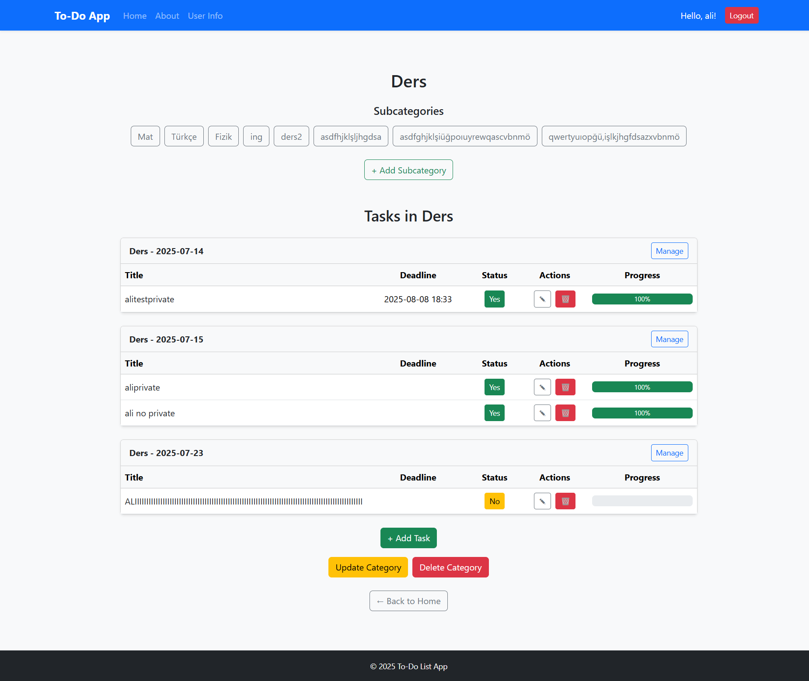
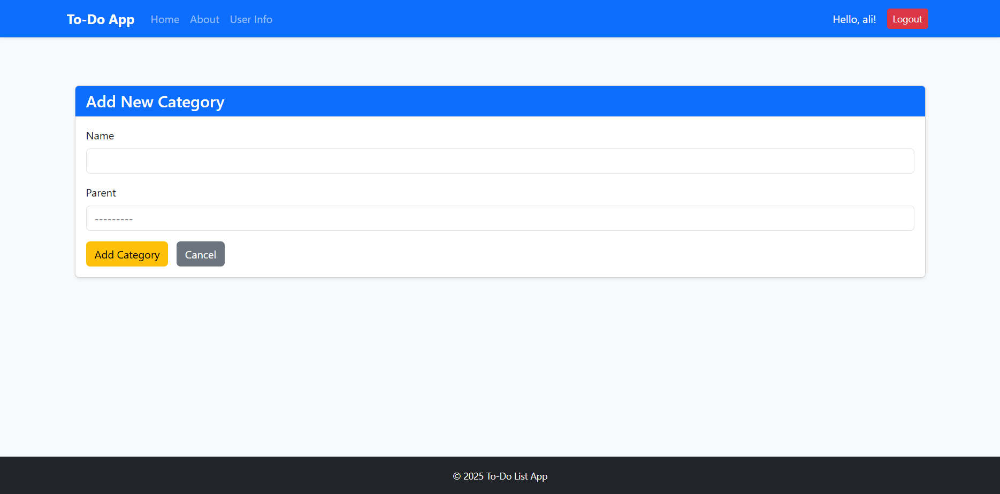
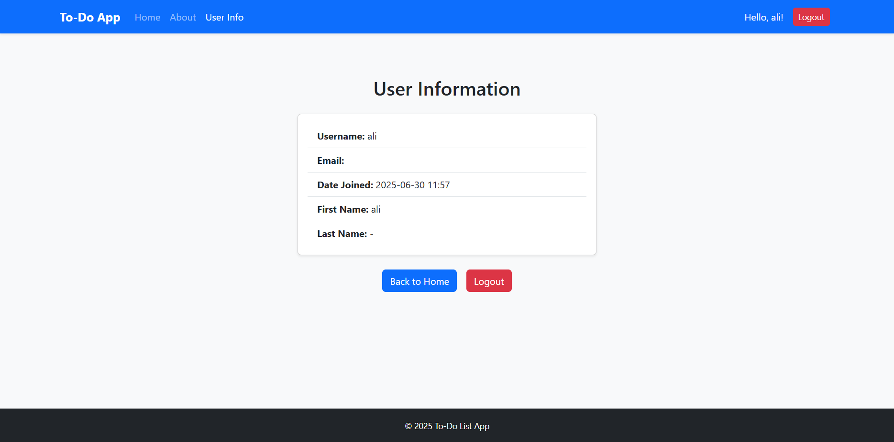

# 📂 To-Do App – Django Application

This is a standalone Django application within the larger project that provides users with the ability to manage personal to-do tasks. It allows authenticated users to add, update, categorize, and delete their own to-dos. Superusers can see all to-dos, regardless of ownership.

---

## 🔧 Features

- 📆 Create, update, and delete tasks
- 🔑 Mark tasks as private or public
- ⏰ Track deadlines and finished dates
- 📂 Categorize to-dos
- 🌟 Simple and styled UI using Bootstrap

---

## 🔍 Interface Overview

Below are the key pages of the todo_app interface. Each image is followed by a brief description. To display these screenshots properly in GitHub, place the images in a folder named `/screenshots/` at the root of your repository and reference them relatively.

### 🔑 Login Page
Enables users to log in with their credentials.


### ✍️ Register Page
Lets users register a new account by entering a username and password.


### 📄 All To-Dos
Lists to-dos for the logged-in user. Admins can see all tasks.


### ➕ Create To-Do
Allows creation of a new to-do, category selection, and optional privacy marking.


### ✏️ Update To-Do
Update a task's title, description, deadline, or finished state.



### 📂 Category View
Show tasks under a specific category.



### ➕ Add Category
Users can define new categories.



### 👤 User Info Page
Displays current user details.



### ℹ️ About Page
Static information page about the app.


<<<<<<< HEAD

### 🗂️ Subcategory View
View and manage subcategories within a category.


### 🆕 Create To-Do Category
Add a new category for organizing your to-dos.


### 🔄 Update Category
Modify the name or details of an existing category.


=======
>>>>>>> 2e387a43ec55b02ba8d74834d3508d34bd6560aa

---

## 🚀 Usage

This app is part of a Django project. Make sure to run migrations and create a superuser before use:

```bash
python manage.py makemigrations
python manage.py migrate
python manage.py createsuperuser
python manage.py runserver
```

---

## 🌐 Notes

- By default, new to-dos are marked as private.
- Admin users can view and manage all to-dos, including private ones.
- The interface uses Bootstrap 5 for styling.

---

Feel free to customize the app and extend its functionality as needed!

